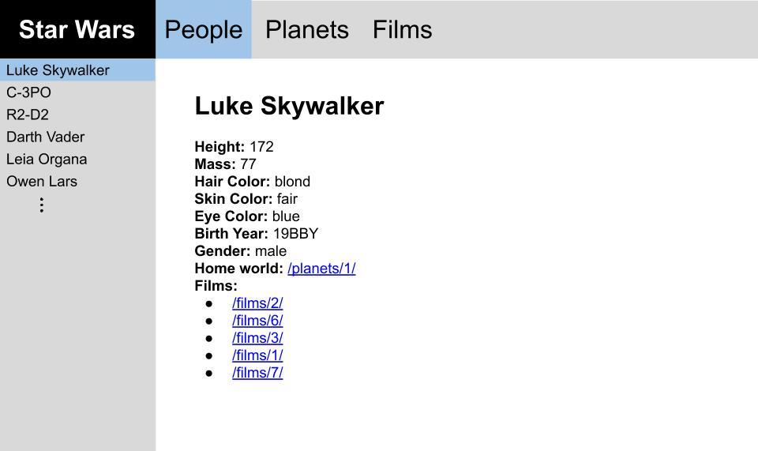

# Assignment 2

**Assignment due at 11:59pm on Monday, 2/6/2023** 
**Grading demo due by 11:59pm on Monday 2/27/2023**

The goal of this assignment is to use React Router to create a moderately complex, multi-page application based on simulated application data.

Here, you're provided with code for an application initially created using Create React App and then pared down somewhat to eliminate some clutter that's not relevant to the assignment.  All of the normal Create React App workflows will work as expected.  For example, you can launch the development server by running `npm start` (making sure to run `npm install` before you run the app for the first time).

In addition to the application code, there's also a directory of simulated application data in `src/data/`.  This data is derived from the [Star Wars API](https://swapi.dev/) (which is missing some movies, unfortunately) and represents typical data you might build a web application around.  The data is in JSON format (which can be directly `import`ed via Webpack) and is split into three different categories:
  * People (`people.json`)
  * Planets (`planets.json`)
  * Films (`films.json`)

Each of the data files has the same overall structure, though the individual data elements in each file contain slightly different fields relevant to the specific kind of data represented in the file.  For example, elements in `people.json` have fields like `name`, `height`, `mass`, etc., while elements in `films.json` have fields like `title`, `opening_crawl`, `director`, etc.  Take a minute to familiarize yourself with the format of each kind of data element because you will have to implement components to display each kind of data.

Your job for this assignment is to develop an app that lets you explore this data.  The app will have three main "pages", one for each kind of data.  On each of these pages, the user will be able to select one specific item from the corresponding collection of data to see more details about that item.  Below is a simple mock that demonstrates very roughly what the app might look like:

The application you write should contain three main structural elements, each of which is described below.  Importantly, you must use React Router to implement the application's navigational features.

## Navbar

The navbar should span the top of the application and should contain four things: a site title that links to the application's homepage (i.e. the root URL path, `/`), and three links to navigate to each of the "people", "planets", and "films" pages.  The link corresponding to the page that's currently "active" should be highlighted.

## Sidebar

The sidebar should be positioned along the left side of the page and should contain a list of all of the elements in the data category corresponding to the "active" link in the navbar.  In other words, if the user clicks the "people" link in the navbar, then a list of all of the characters from `people.json` should appear in the sidebar.  The data elements in the sidebar should be listed by name/title, as appropriate.

Each data element in the sidebar should be a link that functions as described below.  As with the navbar, the "active" sidebar link should be highlighted.

If you can, try to implement the sidebar in such a way that it can be scrolled independently of the rest of the page.

## Main content pane

The main content pane should be positioned at the center of the application.  It should occupy all of the viewport space not occupied by the navbar or the sidebar.  When the user clicks on one of the sidebar links, a detailed view of the corresponding data element should be displayed in the main content pane.  For example, if the user clicks "Luke Skywalker" in the sidebar, a detailed view of the Luke Skywalker data should be displayed in the main content pane.

The detailed view should display all data fields for the corresponding data element, whatever type of element it happens to be (i.e. person, planet, or film).  To make this easier, it might make sense to implement a separate component to display each different type of data element (e.g. `<Person>`, `<Planet>`, and `<Film>`).

For all data types, any data fields that contain an array should be rendered as an unordered list, and any data fields that refer to other data elements should be rendered as links to those elements.  For example, a person's `homeworld` field should be rendered as a link to the corresponding planet, and a film's `characters` field should be rendered as an unordered list of links to the corresponding people.

If no element from the sidebar is "active" (e.g. when the user first clicks a link in the navbar), then the main content pane should contain some simple text related to the "active" navbar link.

## Other details

Here are a few other details about the app you'll need to implement:

  * If the user navigates to the root URL path (i.e. `/`, the application's "homepage") you should display a simple page with some basic text about the application.  This page should *NOT* display the sidebar, but it *should* still have the navbar.

  * You should implement a very basic 404 page to handle any URLs that don't correspond to pages in your application.  If a user types a URL that doesn't map to a data element from the "people", "planets", or "films" datasets, you should render the 404 page.

  * Be careful with the data, and don't assume every data index is used in each file.  Some indexes (like 17 in `people.json`) might be missing.

## Application styling

You will need to write CSS to implement some of the features described above.  However, beyond the very broad description above, there are no strict requirements about how the application should be styled.  You can use the application mock above as inspiration, but there's no need to closely match its styling.  In general, don't worry about implementing a highly polished application in terms of styling.  In other words, your application can be minimally styled, as long as it satisfies the requirements described above.

Note that the app is already set up so that you can write your CSS code in `src/App.css`.

## Assignment submission

We'll be using GitHub Classroom for this assignment, and you will submit your assignment via GitHub.  Just make sure your completed files are committed and pushed by the assignment's deadline to the main branch of the GitHub repo that was created for you by GitHub Classroom.  A good way to check whether your files are safely submitted is to look at the main branch your assignment repo on the github.com website (i.e. https://github.com/osu-cs494-w23/assignment-2-YourGitHubUsername/). If your changes show up there, you can consider your files submitted.

## Assignment grading

This assignment is worth 10 points total.

Remember that in this course, programming assignments will be graded based on effort instead of correctness, and you will get full credit for an assignment if it is submitted on time and is clearly the product of a determined effort to solve the problem.  Again, If you’re unable to solve the homework problem, make sure to submit all code you’ve written, and then describe in comments in the source code the following three things:
  1. How you attempted to solve the problem.
  2. Where you ran into trouble.
  3. What options you think (conceptually) might lead to a working solution.
